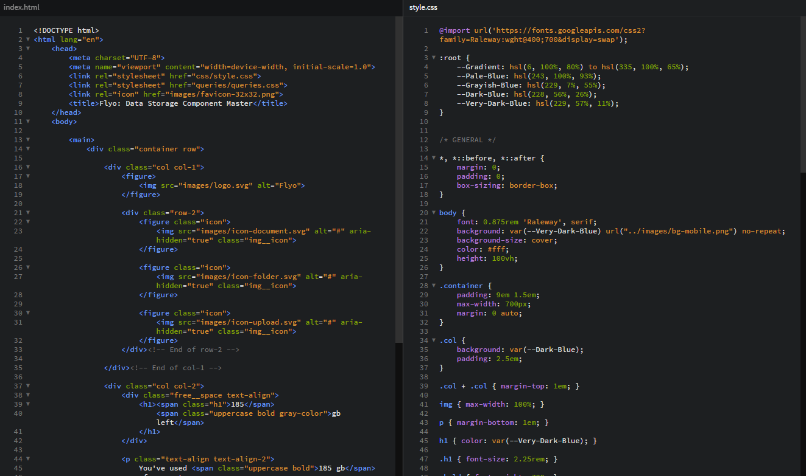

# Frontend Mentor - Fylo data storage component solution

This is a solution to the [Fylo data storage component challenge on Frontend Mentor](https://www.frontendmentor.io/challenges/fylo-data-storage-component-1dZPRbV5n). Frontend Mentor challenges help you improve your coding skills by building realistic projects. 

## Table of contents

- [Overview](#overview)
  - [The challenge](#the-challenge)
  - [Screenshot](#screenshot)
  - [Links](#links)
- [My process](#my-process)
  - [Built with](#built-with)
  - [Continued development](#continued-development)
- [Author](#author)

## Overview

### The challenge

Users should be able to:

- View the optimal layout for the site depending on their device's screen size

### Screenshot

### Links

- Solution URL: [https://www.frontendmentor.io/solutions/flyo-data-storage-data-component-master-QptwXyTYeB](https://www.frontendmentor.io/solutions/flyo-data-storage-data-component-master-QptwXyTYeB)

- Live Site URL: [https://tzienom.github.io/Flyo-Data-Storage-Component/](https://tzienom.github.io/Flyo-Data-Storage-Component/)

## My process

### Built with

- Semantic HTML5 markup
- CSS custom properties
- Flexbox
- Mobile-first workflow

### Continued development

- Flexbox
- Responsive layout

### Useful resources

- [CSS Tricks](https://css-tricks.com/snippets/css/css-triangle/) - This helped me learn how to draw triangles.

## Author

- Frontend Mentor - [@Tzienom](https://www.frontendmentor.io/profile/Tzienom)